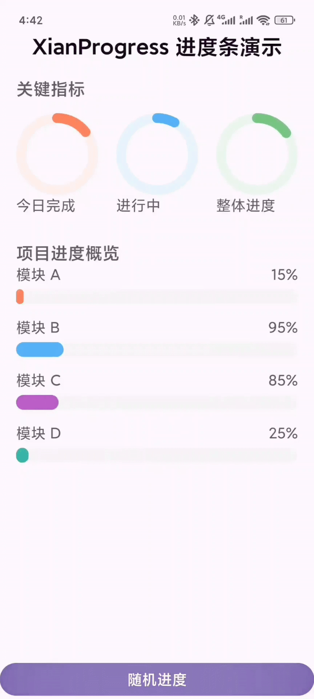

# Progress

一个现代化的Android进度条库，支持自定义动画和主题。

## 组件预览



> 建议在 GitHub 上查看 README 以获得最佳预览效果。

## 特性

- 🎯 同时支持水平进度条与圆环进度条
- 🎨 可自定义背景色和进度色（支持 XML 配置）
- ⚡ 可配置动画开关、动画时长，支持每次动画从 0 开始（`animateFromZero`）
- 🔧 支持圆角半径、条高/笔宽（圆环使用 `progressHeight` 作为笔宽）
- 📱 支持Android 8.0+ (API 26+)
- 🚀 基于Kotlin和现代Android技术栈
- 🔢 支持int和float进度值
- ⏸️ 支持动画暂停与恢复（水平）

## 安装

### JitPack

在项目根目录的 `settings.gradle.kts` 中添加：

```kotlin
dependencyResolutionManagement {
    repositories {
        // ... 其他仓库
        maven { url = uri("https://jitpack.io") }
    }
}
```

在模块的 `build.gradle.kts` 中添加依赖：

```kotlin
dependencies {
    implementation("com.github.Xianbana:Progress:1.0.0")
}
```

## 使用方法
## 下载体验

- 前往 GitHub Releases 页面下载最新 APK：
  - 最新版（自动随 Tag 生成）：`https://github.com/Xianbana/XianProgress/releases/latest`
  - 或在具体版本页下载：`https://github.com/Xianbana/XianProgress/releases/tag/v1.0.0`


### 1. XML属性配置（水平进度条）

```xml
<com.xian.progress.HorizontalProgressBar
    android:id="@+id/progress_bar"
    android:layout_width="match_parent"
    android:layout_height="25dp"
    app:progressBackgroundColor="#F0F0F0"
    app:progressColor="#9C27B0"
    app:progress="0"
    app:enableAnimation="true"
    app:animateFromZero="true"
    app:animationDuration="1500"
    app:cornerRadius="12dp"
    app:progressHeight="25dp" />
```

### 2. XML属性配置（圆环进度条）

```xml
<com.xian.progress.CircularProgressBar
    android:id="@+id/circle_progress"
    android:layout_width="120dp"
    android:layout_height="120dp"
    app:progressBackgroundColor="#EAEAEA"
    app:progressColor="#FF5722"
    app:enableAnimation="true"
    app:animateFromZero="true"
    app:progress="66"
    app:progressHeight="12dp" />
```

> 注：圆环组件使用 `progressHeight` 作为画笔宽度（笔粗）。

### 支持的XML属性

| 属性 | 类型 | 默认值 | 说明 |
|------|------|--------|------|
| `progressBackgroundColor` | color | #F3F3F3 | 背景颜色 |
| `progressColor` | color | #FF5722 | 进度颜色 |
| `progress` | float | 0 | 初始进度值 |
| `enableAnimation` | boolean | true | 是否启用动画 |
| `animateFromZero` | boolean | true | 每次动画是否从 0 开始 |
| `animationDuration` | integer | 1000 | 动画时长（毫秒） |
| `cornerRadius` | dimension | 360dp | 圆角半径（水平条） |
| `progressHeight` | dimension | 20dp | 条高（水平）/ 笔宽（圆环） |

### 3. 代码配置

```kotlin
// 在代码中设置进度
val progressBar = findViewById<HorizontalProgressBar>(R.id.progress_bar)

// 支持多种进度值类型
progressBar.setProgress(75)      // int
progressBar.setProgress(75.5f)   // float
progressBar.setProgress(75.0)    // double

// 设置自定义配置
val config = ProgressConfig(
    backgroundColor = Color.parseColor("#E0E0E0"),
    progressColor = Color.parseColor("#4CAF50"),
    enableAnimation = true,
    animationDuration = 1500L,
    cornerRadius = 20f
)
progressBar.setProgressConfig(config)
```

### 4. 进度监听

```kotlin
progressBar.onProgressChanged = { progress ->
    textView.text = "进度: ${String.format("%.1f", progress)}%"
}

progressBar.onProgressComplete = { success ->
    if (success) {
        textView.text = "进度完成！"
    }
}
```

### 5. 动画控制（水平）

```kotlin
if (progressBar.isAnimating()) {
    progressBar.pauseAnimation()
}
progressBar.resumeAnimation()
progressBar.reset()
```

## API 参考（节选）

### ProgressConfig

| 属性 | 类型 | 默认值 | 说明 |
|------|------|--------|------|
| backgroundColor | Int | #F3F3F3 | 背景颜色 |
| progressColor | Int | #FF5722 | 进度颜色 |
| enableAnimation | Boolean | true | 是否启用动画 |
| animateFromZero | Boolean | true | 每次动画从 0 开始 |
| animationDuration | Long | 1000L | 动画时长（毫秒） |
| cornerRadius | Float | 360f | 圆角半径（水平） |

### ProgressData

| 属性 | 类型 | 说明 |
|------|------|------|
| progress | Number | 进度值 (0-100)，支持int、float、double等 |
| color | Int? | 进度颜色，null时使用配置中的默认颜色 |

### HorizontalProgressBar / CircularProgressBar

- `setProgressConfig(config: ProgressConfig)`
- `setProgress(progress: Number)` / `setProgress(progress: Int/Float)`
- `getCurrentProgress(): Float` / `getTargetProgress(): Float`
- （水平）`isAnimating()/pauseAnimation()/resumeAnimation()/reset()`
- `onProgressChanged: (Float) -> Unit`
- `onProgressComplete: (Boolean) -> Unit`

## 示例

查看 `app` 模块中的 `MainActivity` 了解完整的仪表盘示例，包括：

- 三枚圆环 KPI（支持动画与从 0 开始）
- 多条水平进度条概览（多色主题）
- 一键随机进度演示按钮


## 发布信息

- **Group ID**: `com.github.Xianbana`
- **Artifact ID**: `Progress`
- **版本**: `1.0.0`
- **许可证**: MIT License


## 许可证

MIT License - 详见 [LICENSE](LICENSE) 文件
